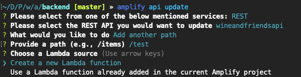

## Wine and Friends ~ Kompetensdag ~ Vi lajvar start-up

#### Struktur
Frontend-koden hittar du direkt i `/src`. 

Vår infra och backend-kod ligger under `/amplify/backend`. Där hittar du templates etc. för API Gateway under `/amplify/backend/api`, dock bör vi inte behöva pilla där så mycket då vi ska använda oss av Amplify cli:t. 

Där emot under `amplify/backend/function` ligger våra lambdas/functions i respektive mapp, och där måste vi såklart in och koda då det är de som utgör våran backend.

Denna struktur sätts upp av Amplify när man först initierar ett projekt.

#### Amplify
Tanken är alltså att vi ska använda Amplify så mycket som möjligt, så för att lägga till en ny endpoint i API Gateway samt ett tillhörande Lambda, använd följande Amplify kommando:

`amplify api update`

Man får upp olika alternativ så det handlar bara om att välja rätt, som på bilden nedan.



#### Bygg och kör fontend:en localt
```
npm install
```

###### Compiles and hot-reloads for development
```
npm run serve
```

###### Compiles and minifies for production
```
npm run build
```

###### Lints and fixes files
```
npm run lint
```


#### Vin API:n
[Systembolagets härliga XML-fil](https://www.systembolaget.se/api/)

[Global Wine Score](https://www.programmableweb.com/api/global-wine-score-rest-api)
hej
